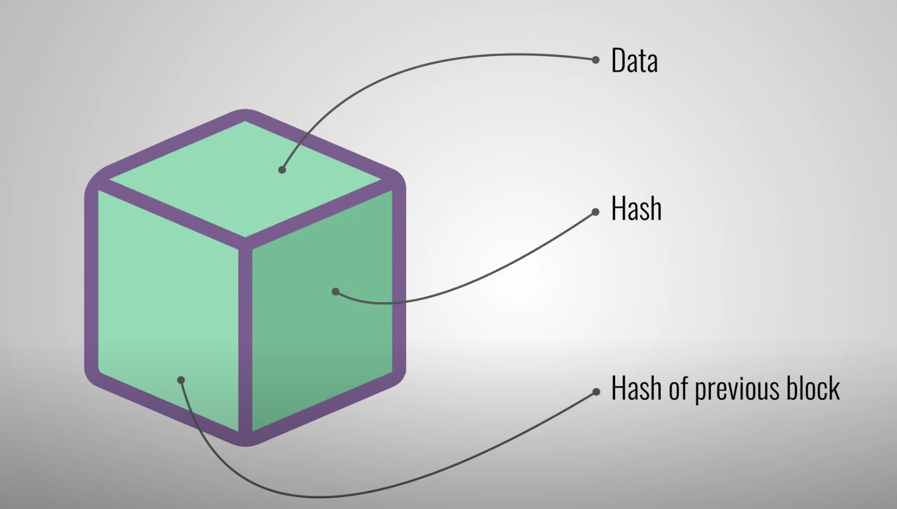
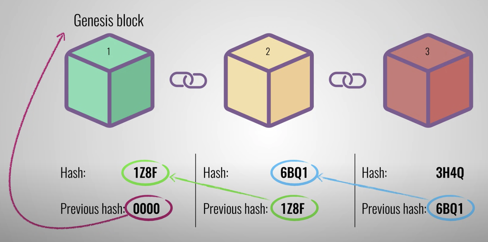

# Blockchain.

A blockchain as its name states, is a chain of blocks. A blockchain is a distributed ledger that is completely open to anyone and holds transactions information.

Each block contains some data, the hash of the block and the hash of the previous block.

The hash is like a fingerprint because it's unique and identifies the block and its content. A hash can tell if there has been changes to a block. The hash of the previous block is what creates a "chain" and is what makes it so secure. The first block is called a genesis block because it cannot point to any previous hash.

If you try to tamper a single block it will invalidate the following blocks because the previous hash is not right, and also there's a mechanism called proof of work which slows down the creation of new blocks so that fast computers that exist nowadays won't be able to change all blocks in a chain.

There's another way in which blockchain keeps itself secure and it is by being distributed. By using a peer to peer network where everyone is allowed to join it keeps itself decentralized and everyone gets a copy of the chain. When someone creates a new block, that block is sent to everyone on the network and each node verifies that the block hasn't been tampered with and if everything checks out each node adds the block to their own block chain.
